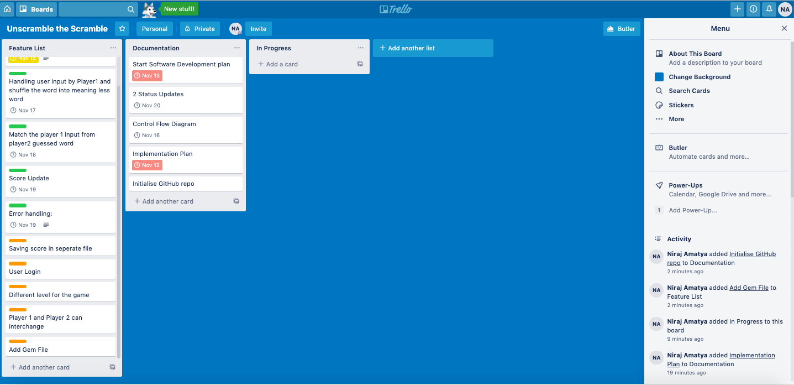
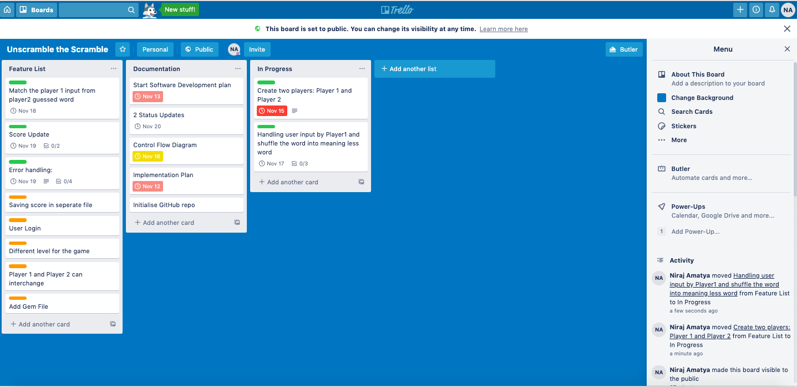
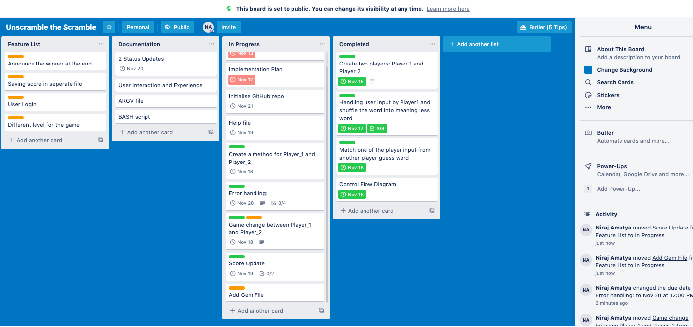
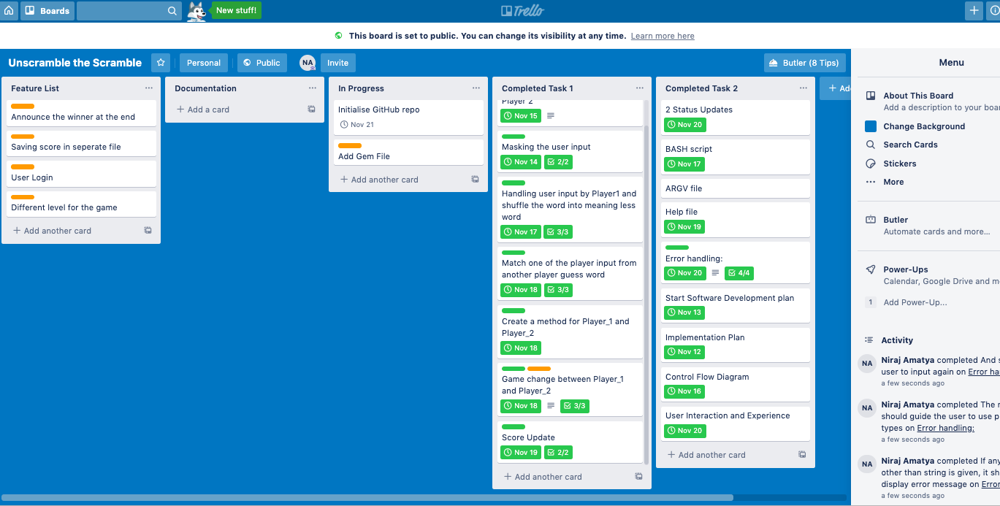
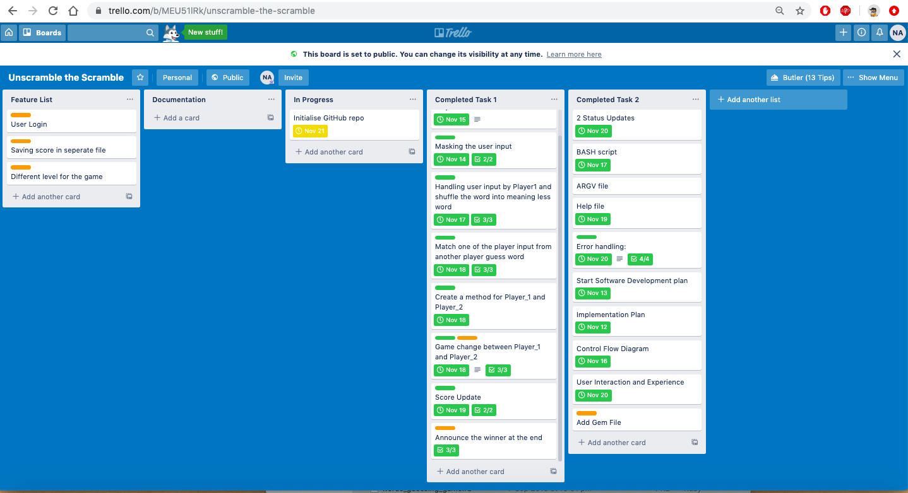

## **Description**
Unscramble The Scramble is the word guessing game. This game is developed generally for kindergarten kids, however; it will suit any age group. This game aims to make learning and retaining the words and vocabulary less stressful and more fun. As this game can be played between the friends by challanging each other, it will make it competitive at the same time.

In this game one player will input the word which will be than scrambled and another player has to unscramble this word. Whoever makes the must guesses wins the game.

## **Implementation Plan**

| Features                                 	|                                                                                                     Checklist                                                                                                    	| Priority 	| Deadline       	|
|------------------------------------------	|:----------------------------------------------------------------------------------------------------------------------------------------------------------------------------------------------------------------:	|---------:	|----------------	|
| String only data types                   	| 1. Only string is accepted as a data type.  2. Should receive error message if any other data type is entered.  3. Should ask to input correct data type.                                                  	|     High 	| 13th Nov, 2019 	|
| Maske the user input                     	|                                                                          1. Word input by Player_1 should be invisible in the terminal.                                                                          	|     High 	| 14th Nov, 2019 	|
| Scramble the word                        	|                                  1. Words need to split into characters. 2. Characters need to be shuffled. 3. Shuffled characters need to join and create scrambled word.                                 	|     High 	| 17th Nov, 2019 	|
| Number of guesses allowed for every word 	| 1.Maximum number of guess allowed should be pre-defined. 2.With every wrong guess user should be informed about number of guess left. 3. After all three guess, it should output the right word.         	| Medium   	| 18th Nov, 2019 	|
| Switch the game between players          	| 1. The application should clearly inform the users about their role i.e which one is the provider of the word and which one is guesser. 2.This should be applied to every functions later in the game.  	| Medium   	| 19th Nov, 2019 	|
| Score Update                             	| 1. Score should be updated with every right guess. 2. It should not display until the game is finished for both players. 3. Scores will be compared between the players and winner will be displayed       	| Low      	| 18th Nov, 2019 	|

## **Status Update**

| Sr. No. | Date/Day/Time                     | Title                                 | Description                                                                                                                                                                                                                                                                                                                                                                                                                                                                                                                                                                                                                                                                                                                                                                                                                                                                                                                                        |
|---------|-----------------------------------|---------------------------------------|----------------------------------------------------------------------------------------------------------------------------------------------------------------------------------------------------------------------------------------------------------------------------------------------------------------------------------------------------------------------------------------------------------------------------------------------------------------------------------------------------------------------------------------------------------------------------------------------------------------------------------------------------------------------------------------------------------------------------------------------------------------------------------------------------------------------------------------------------------------------------------------------------------------------------------------------------|
| 1       | 9th Nov, 2019 Saturday 1:30 pm    | Terminal App Idea                     | On week 4 Saturday 9th Nov, I, spoke with Bianca for my terminal apps. I decided to do the Words Guessing game.  The game would basically generate scrambled words from randomly, picked words from the collection of words. The  user would have to correctly guess the right word. Words will be either picked from seperate files that will have collection  of words or user Faker. Another alternative was to use API to get words from the some Dictionary or other sources from  Internet. The game will have different levels depending such as Easy, Difficult and really Hard. It will also score user  depending upon the right guess they make. I was advised by Bianca to start with just the basic functionality of the app  which will be the Donut for the app. I completely agree with her and planned to start with the basic features of the app that  will make it functional and do what it intends to do in the basic level. |
| 2       | 13th Nov, 2019 Wednesday 12:15 am | Major change with the functionality   | As I was developing the game, I realised that if I am making game for the kids it should be fun and challenging as well. Therefore; I decided to introduce two players in my game that will challenge each other and there will be winner at the end. So  I won't be getting words from other resources. Instead one player will input the word which will be shuffled and scrambled into meaningless word. The other player will have to guess the right word to score points. After one player will finish with guessing,  the game will switch the players and another player has to guess the word. Both the players score will update at the end and winners will be discussed.  I discussed my idea with Bianca and Alex our senior dev and lecturer on 14th Nov 2019, Thursday. They were happy with the whole concept and got a green signal to start building it.                                                                         |
| 3       | 15th Nov, 2019 Friday 3: 20 pm    | Struggling with switching the players | Although I have finished most part of the game; switching between the players have been really challenging for me. I spoke with Alex, our Senior dev about the issue. He advised me to use methods in my game. As I am not comfortable with using methods; I am bit hesitant. I am trying for other possible ways to do it. I haven't come up with solution yet.                                                                                                                                                                                                                                                                                                                                                                                                                                                                                                                                                                                   |
| 4       | 16th Nov, 2019  Saturday 7:30 pm  | Switching player successfull          | Finally I am able to switch the players in the game.  Thanks to Alex, who taught me how to use methods today in the class. I am  really happy with the output.                                                                                                                                                                                                                                                                                                                                                                                                                                                                                                                                                                                                                                                                                                                                                                                     |

## **Project Management: Trello**

**[Trello Link](https://trello.com/b/MEU51lRk/unscramble-the-scramble/)**

Trello Software is used to track the progress of the application. Any changes with the features, checklists, deadlines and time-frame for each feature are updated in the trello. 

#### 11th Nov, 2019 (Saturday, 7:12 pm)
The following [Trello Board](/images/Trello1.png) demonstrated the app project planning status and tasks breakdown.

#### 13th Nov, 2019 (Wednesday, 1:30pm)
The following [Trello Board](/images/Trello2.png) demonstrated the app project planning status and tasks breakdown.

#### 16th Nov, 2019 (Saturday, 9:18pm)
The following [Trello Board](/images/Trello3.png) demonstrated the app project planning status and tasks breakdown.

#### 19th Nov, 2019 (Tuesday, 2:02pm)
The following [Trello Board](/images/Trello4.png) demonstrated the app project planning status and tasks breakdown.

#### 20th Nov, 2019 (Wednesday, 3:05pm)
The following [Trello Board](/images/Trello5.png) demonstrated the app project planning status and tasks breakdown.

